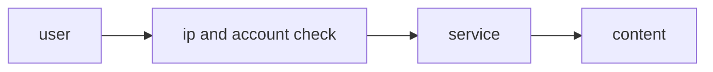
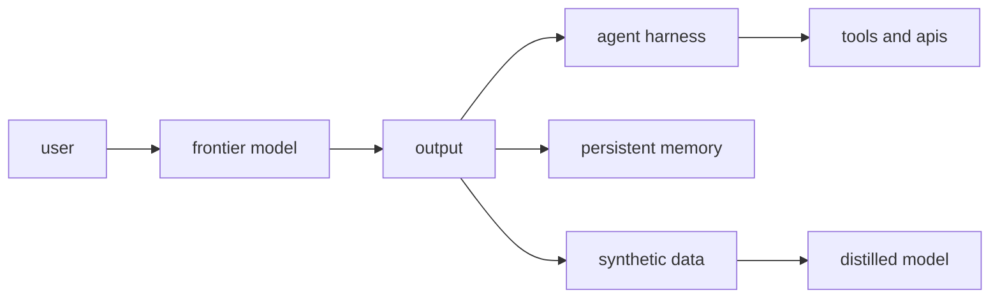
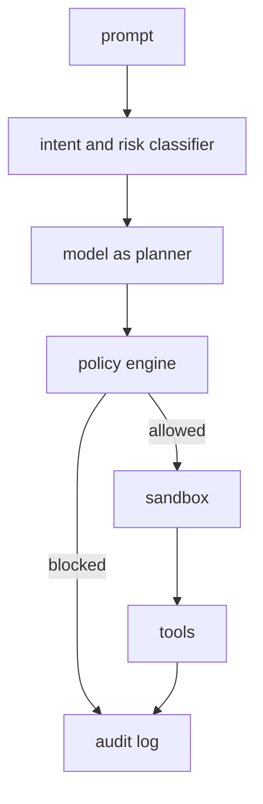
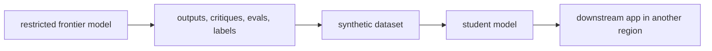
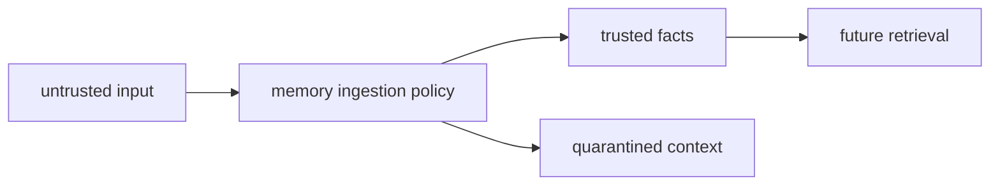
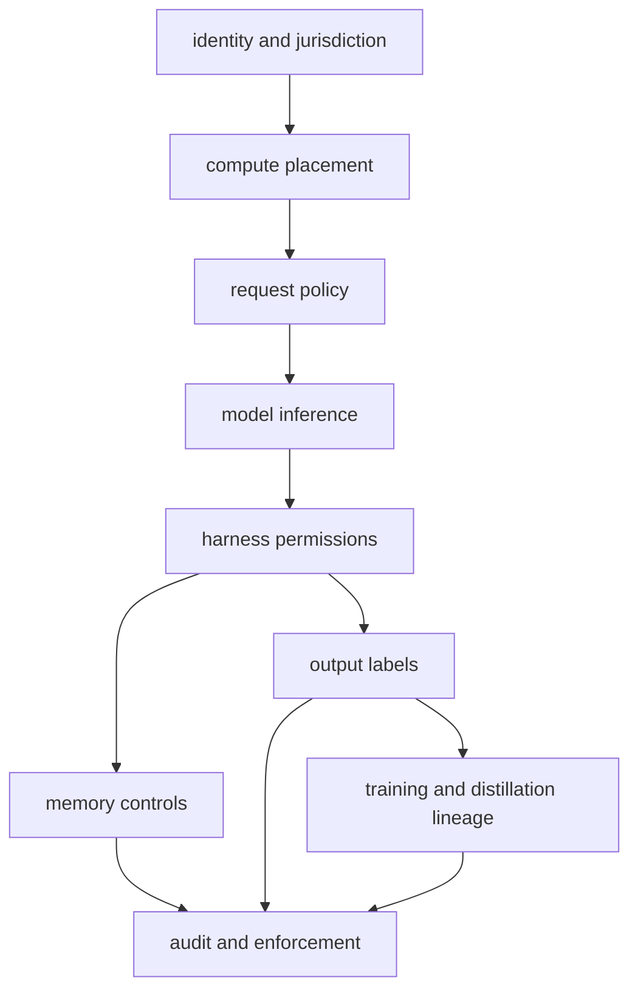

the first generation of internet geofencing was simple enough to describe.

you checked an ip address. maybe a billing country. maybe a phone number. if the user appeared to be in the wrong place, you blocked the request.

messy, but understandable.

ai breaks that model.

a frontier model is not a static piece of content. it is a capability surface. once someone gets access, the capability can move through prompts, outputs, agents, tools, memory, synthetic data, evals, fine-tunes, and smaller distilled models.

so the question stops being:

> where is the user?

and becomes:

> where does the capability go after the model responds?

that is a much harder problem.

## the old geofence was built for content
geofencing made sense when the thing being protected was a movie, a sports stream, a gambling app, or a payments flow.

the service had a relatively clean boundary.

if the gateway said no, the user did not get the content.

ai does not work like that. the model output can become a plan, a script, a synthetic dataset, a memory entry, a tool call, or a training signal. the answer is often not the final artifact. it is an intermediate artifact that changes another system.

that is the uncomfortable part. the boundary is no longer the api call.

## access control is necessary. it is not enough.
you still need the obvious controls.

verify the customer. bind api keys to accounts. check region. block sanctioned users. enforce cloud placement. log requests. limit abuse.

all of that matters.

but access control only tells you who entered the room. it does not tell you what they carried out.

a permitted user can call a restricted model and use the output inside a downstream workflow. a company can expose the result through an internal tool. an employee can paste it into a crm. an agent can store it in memory. another model can train on it.

the model may remain geofenced. the capability may not.

that distinction matters more as models become less like chatbots and more like planning engines.

## the thing to geofence is not always the model
there are several different things people mean when they say "geofence the model."

they often collapse these into one policy, but they are different engineering problems.

### 1. geofencing the user
this is the normal version.

is the person in an allowed country? are they part of an approved company? are they a permitted user under the policy?

you can use ip checks, account verification, billing data, corporate identity, device signals, and risk scoring.

this works well enough for normal customers. it works poorly against determined adversaries, shell companies, proxies, and indirect access.

### 2. geofencing the compute
where does inference happen?

this is a cleaner technical control when the provider owns the infrastructure. you can require inference to run in approved regions, bind keys to region-specific deployments, use attested hardware, and log where the workload ran.

this is much harder once weights leave the provider’s runtime.

closed api model: possible.

downloaded weights: mostly gone.

edge deployment: depends on device controls.

open source checkpoint: good luck.

### 3. geofencing the request
what is the user asking the model to do?

a harmless summary request and an autonomous cyber workflow should not be treated the same way. neither should a coding question, a vulnerability chain, a bio-design request, or a financial trading instruction.

this requires request classification before inference and output review after inference.

the important bit: the model can help classify the request, but it should not be the only enforcement layer. natural language policy is not a security boundary. it is a signal.

### 4. geofencing the harness
this is where the architecture gets interesting.

in an agentic system, the model usually proposes actions. the harness decides what actually happens.

the harness controls tools, memory, files, browsers, shell access, external apis, write permissions, approval flows, and audit logs.

this is the most practical place to enforce real restrictions.

the model can be tricked. the harness should not be so easy to trick.

a jailbreak should be allowed to compromise the model’s reasoning. it should not automatically get shell access, repo access, deployment access, customer data access, or permission to write durable memory.

that is the engineering standard we should be aiming for.

not "the model can never say a bad thing."

more like:

> the model can say something bad, and nothing irreversible happens.

## distillation is the hard case
distillation is where geofencing starts to get weird.

suppose a restricted model is only available in one geography. a permitted user uses it to generate synthetic data. that data trains a smaller model. the smaller model is deployed somewhere else.

did the capability cross the border?

technically, the original model never moved.

but its behavior may have.

this is the part current policy language often struggles to describe.

weights are easy to talk about. endpoints are easy to talk about. outputs are harder. training lineage is much harder.

a model can inherit capability through:

- synthetic examples
- reasoning traces
- eval rubrics
- code review feedback
- preference labels
- tool-use demonstrations
- task decomposition patterns
- generated test suites

some of these artifacts look harmless in isolation. together, they can teach another system how to behave.

that means a serious geofencing regime eventually has to ask whether derivative models inherit restrictions from the models that trained or supervised them.

no one has a clean answer here. but pretending the problem does not exist is not an answer either.

## memory is another border
execution is one boundary. memory is another.

if a model sees a malicious instruction once, that is a prompt injection event.

if the system stores that instruction and retrieves it later, that is state compromise.

the second one is worse.

memory needs provenance.

where did this fact come from? who said it? was it user-provided, system-provided, retrieved from a trusted database, or scraped from an untrusted page? is it an instruction, a preference, a fact, or an artifact? should it expire? can it affect future tool use?

without that, memory becomes a slow-motion jailbreak.

this matters for geofencing because persistent state can carry restricted capability across time, teams, and regions. a model output that should have stayed inside one context can become part of another context by being remembered.

## what is actually possible?
we should be honest about the limit.

perfect geographic containment of ai capability is probably not possible. text is copyable. outputs can be paraphrased. synthetic data can move. people can query models indirectly. smaller models can absorb behavior from larger models.

so the goal should not be perfect containment.

the goal should be practical containment.

that means:

- restrict direct access
- prove where inference happened
- limit what tools the model can use
- label sensitive outputs
- prevent unsafe memory writes
- track training lineage
- audit derivative use
- make violations visible

this is less satisfying than a clean country block. it is also closer to reality.

## the missing primitive: capability provenance
current ai infrastructure mostly tracks access.

who called the api? from which account? from which region? at what time?

that is useful, but thin.

we need to track capability flow.

which model produced this output? what policy applied? what tools were available? was the output stored? was it used for training? did it enter another model? did it become part of a workflow exposed to other users?

this starts to look less like geofencing and more like supply chain security.

software learned this the hard way. you cannot secure production by trusting that every dependency is fine. you need provenance, signing, dependency tracking, review, permissions, and runtime monitoring.

ai needs the same shift.

not just model access.

model lineage.

not just user geography.

capability geography.

## what a real ai geofence might look like
a more realistic stack would have layers.

each layer answers a different question.

who is allowed to use this capability?

where is it allowed to run?

what is it allowed to do?

what state can it change?

where can its output go?

can its output train another system?

what restrictions should derivative systems inherit?

that is what geofencing has to become if it is going to survive contact with agentic software.

## the uncomfortable conclusion
the old geofence asked where the user was.

the new geofence has to ask where the capability is going.

that sounds abstract until you look at how ai systems are actually built. models plan. harnesses execute. memory persists. outputs circulate. synthetic data trains. student models inherit behavior. downstream apps hide the original source.

a country block at the api gateway catches only the first hop.

sometimes that is still useful. sometimes it is legally required. sometimes it buys time.

but it is not enough.

ai geofencing needs a new architecture around capability provenance, harness enforcement, memory controls, and derivative lineage.

otherwise, we will keep pretending the border is at the login screen while the actual capability moves through the rest of the stack.
