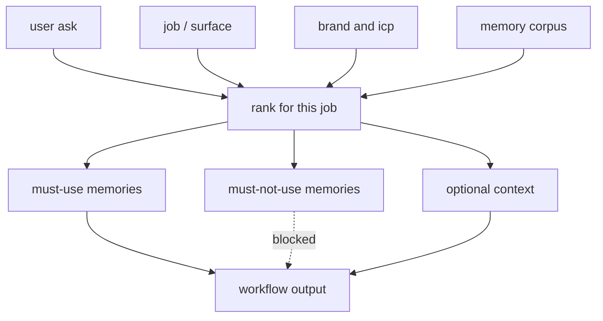

every serious agent stack now claims long-term memory. embeddings. graphs. company brains. session digests. demos look sharp.

production gtm flows still forget the icp decision from three weeks ago. or worse: they retrieve the wrong memory with high confidence.

that failure is not "the model is dumb." it is that we evaluate memory like a search problem and deploy it like a judgment problem.

if your agent is verticalized — gtm, healthcare ops, defense sales, compliance — a generic memory score will not tell you whether the system is safe to run. i wrote earlier about [why memory has to verticalize](/blog/verticalised-memory). this post is the quieter half of that bet: **how you know it worked.**

<Image
  src="/images/blog/why-vertical-agents-need-long-term-memory-evals/memory-evals-cover.png"
  alt="Abstract textured painting: light open space on one side, dense layered memory on the other — generic marks vs a governed vertical spine."
  width={1024}
  height={537}
/>

## what most memory evals actually measure
public and off-the-shelf memory benchmarks tend to ask variants of:

- did we store the fact?
- can we retrieve it given a near-paraphrase?
- does multi-hop retrieval still find entity x?

those are necessary. they are not sufficient for vertical agents.

they optimize for **availability of information**. vertical products need **suitability of information for a specific workflow step**.

a retrieval that returns *something relevant* can still wreck a gtm action. last week's pricing faq when the ask was positioning to a cro. a 2024 competitor note superseded by a decision you recorded yesterday. "founder likes short copy" that applied to linkedin connect notes, not an enterprise deck. a meeting titled "pipeline review" that was actually a recruiting sync mislabeled upstream.

search evals pass these. domain evals should fail them.

## why vertical use cases break those scores
vertical agents compound three constraints generic benchmarks ignore.

**1. job-conditioned relevance**

a gtm agent does not need "everything about acme." it needs the memories that matter for *this* skill: outreach, competitive brief, demo prep, renewals. same company. different memory set.



generic rag skips the middle. it asks "what is similar?" vertical memory asks "what is allowed and useful *for this step*?"

**2. decision precedence over recency or similarity**

in real orgs, a one-line decision — "we do not sell to pre-seed" — outranks forty similar past chats. cosine similarity does not know that. tags help a little. typed memory (decision vs signal vs task vs reference) helps a lot, **if you evaluate for it**.

**3. cross-channel, multi-week trajectories**

gtm memory is not a chat log. it is whatsapp fragments, granola notes, crm updates, linkedin drafts, slack. failures show up weeks later: the agent re-opens a closed objection, or pitches the wrong buyer's priority.

we learned this the hard way building for marketing/gtm. a general "company brain" was not enough. failures that looked like hallucination were often retrieval and ranking against the wrong job. fixing search without changing evals just moves the bug.

there is still no credible third-party benchmark for marketing or gtm memory. so you either invent vanity metrics, or you build your own.

## what a vertical ltm eval has to measure
every golden case should bind:

1. **surface / job** — linkedin connect note, cro demo prep, competitive content brief
2. **brand / icp context** — who the agent is operating as
3. **memory corpus snapshot** — the store *before* the turn, including distractors
4. **user ask**
5. **must-use memories** — decisions or facts that must appear
6. **must-not-use memories** — superseded, wrong-persona, wrong-job facts
7. **judge rubric** — not string match; graded criteria

schematic golden case:

```text
job: linkedin connect note (<=200 chars) to a cro at a series b defense saas

must-use: decision "lead with gtm engineering infra, not lead-gen"
must-not-use: old pitch "founder memory" + investor fundraising draft from paused workstream

pass if: uses current narrative; does not mention fundraising; tone fits cro
fail if: retrieves investor deck talking points or pastes message-length copy into the note
```

that is an eval for long-term memory under a vertical constraint. it is not "can the vector db find the word cro."

dimensions worth scoring every run:

- **decision recall** — did the governing decision surface?
- **suppression** — did obsolete narrative stay out?
- **job fit** — was the memory useful for *this* workflow step?
- **persona fit** — cro vs cmo vs ic operator
- **temporal integrity** — older conflicting facts ranked correctly?
- **abstention** — prefer "i don't have that" over a confident wrong memory

llm-as-judge is fine for v1 — if the rubric is explicit and the dataset is seeded from real production failures, not synthetic trivia.

notice what this deliberately is *not*. it is not locomo. it is not longmemeval. those suites score recall and multi-hop qa. they do not certify operational correctness: durable forget, correction stickiness, tenant isolation, campaign lifecycle. if your vertical agent can ace a recall bench and still name the competitor you banned last quarter, you measured the wrong thing.

## a practical harness
you do not need a paper to start. you need a regression loop.

1. seed 10–20 golden paths from real traces — forgot a ugc preference, wrong narrative, wrong channel format.
2. store each as a dataset item: input + brand context + memory snapshot + rubric.
3. run bulk experiments when you change prompt, retriever, or ranking → judge report card.
4. gate memory changes the way you gate model changes: **no merge if decision-recall drops.**

observability — traces, thumbs, spot judges — is the sensor layer. the ltm eval is the instrument that tells you whether memory improved for the vertical, or just got noisier.

until that loop exists, every "we improved memory" claim is anecdote.

## what we are building toward
at engram, we treat memory as gtm infrastructure: typed context, qualifiers over flat tags, retrieval measured against workflows rather than chat playgrounds.

the product claim and the editorial claim are the same: vertical agents need vertical memory evals. generic rag leaderboards will not protect a cro-facing agent from quietly using last quarter's pitch.

we are building the benchmarks we wished existed for marketing/gtm memory — because the category will not get serious until evaluation does. marketing is the wedge. the architecture is packs over cognitive primitives, not a fork of the schema for every industry. the evidence has to stay honest: ops fixtures and vertical golden paths first; public recall ladders later, when they are earned.

## ship domain evals before domain memory
if you are verticalizing an agent:

- start with 10 failure-shaped memory cases from production
- score must-use / must-not-use, not retrieval@k alone
- make "better memory" mean better job outcomes, not denser indexes

long-term memory without a long-term memory eval is just a growing attic. vertical use cases need a structural engineer.
